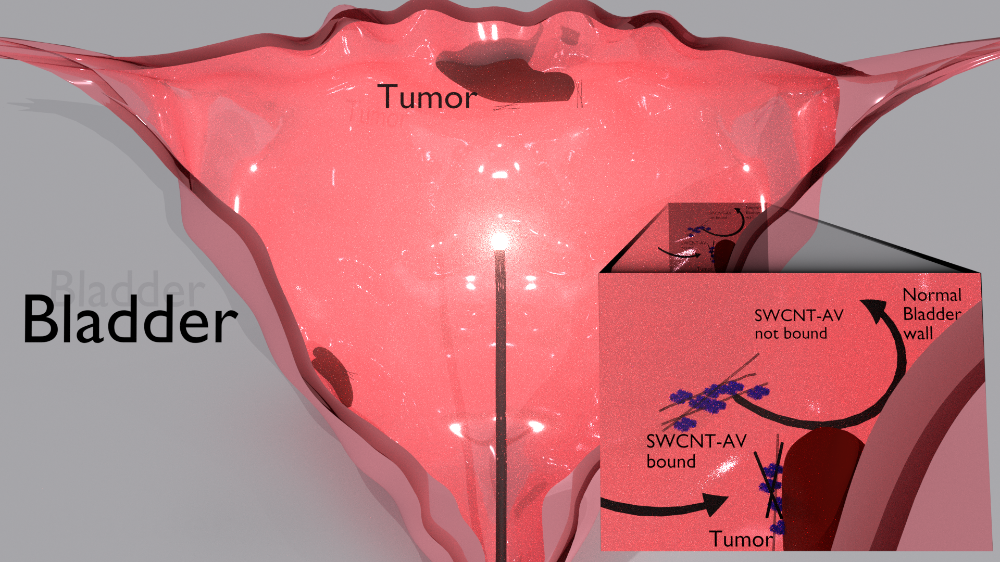
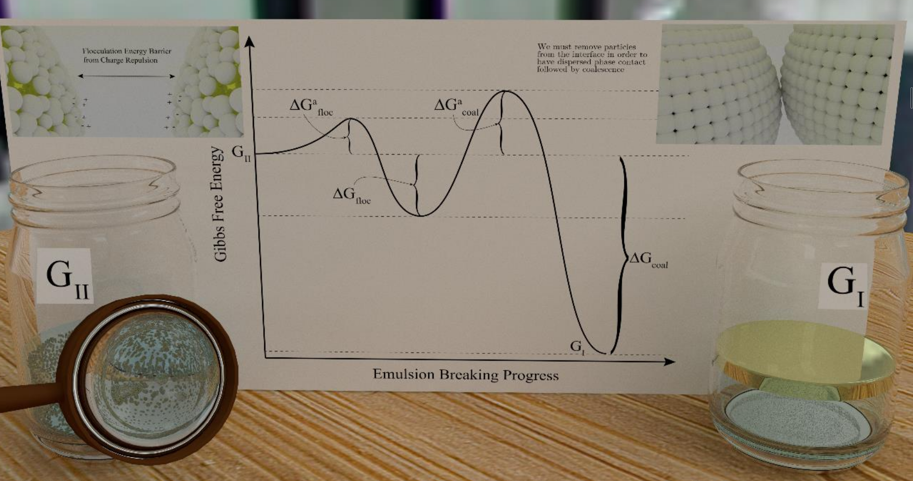
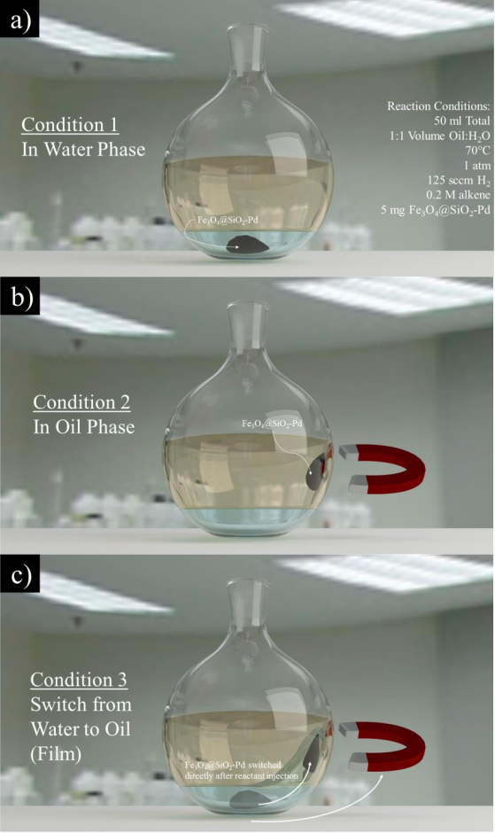

[Home]("chasebrown.io/#top") • [Research]("research.html") • [Publications](https://scholar.google.com/citations?user=qjRD8Z8AAAAJ) • [Design]("design.html") • [Code](https://github.com/chasealanbrown.html)

---
# Scientific Illustrations, Designs, and Graphic

## [Wrenlab mug design](#Wrenlab-mug-design")

## Scientific Illustration of Photothermal Nanoparticle Therapy

## Emulsion Breaking Schematic

              
## Single-walled Carbon Nanotube Illustration

              
## Experimental Setup of Reactor

## [Reaction within Experiment](#Reaction-within-Experiment)

