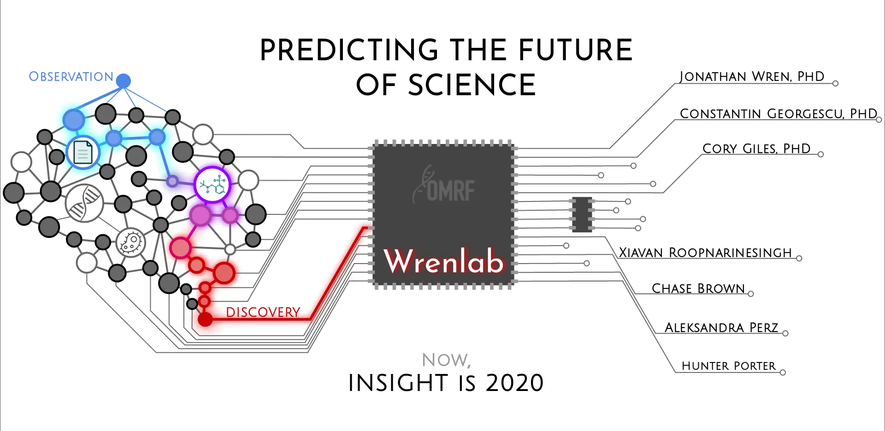
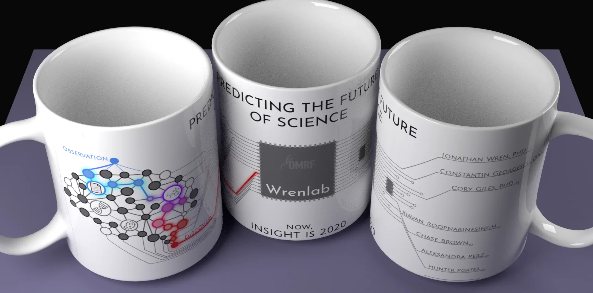
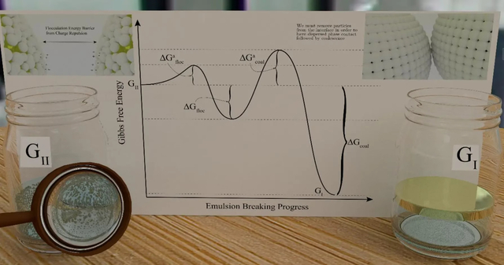
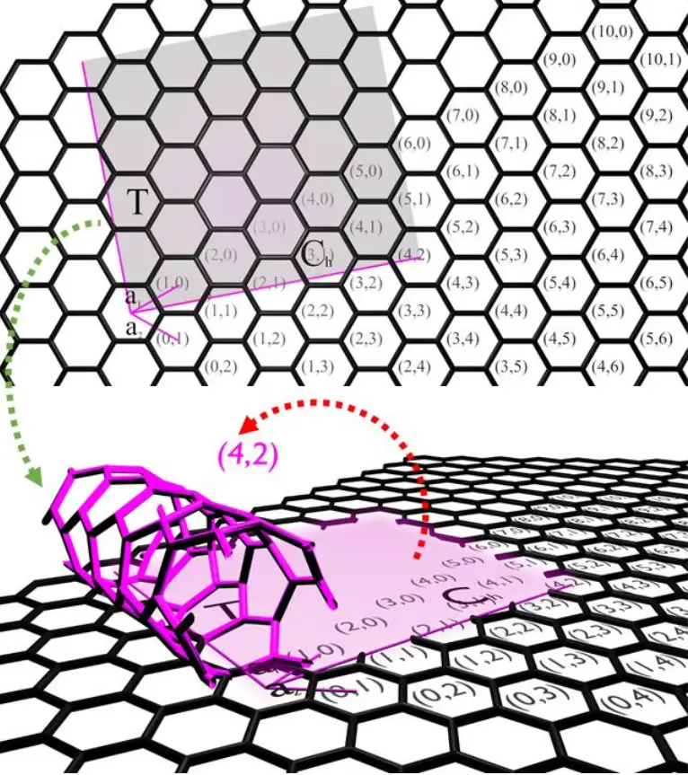
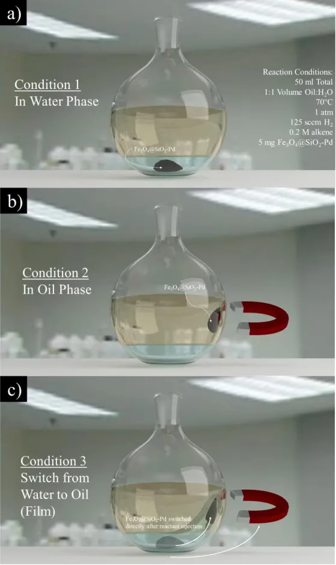
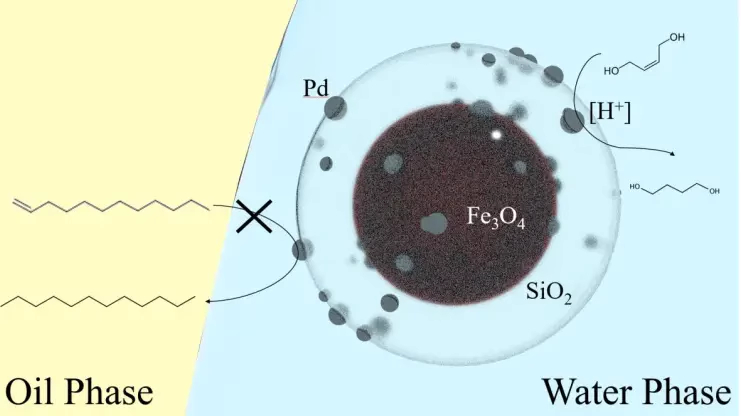

[Home](https://chasebrown.io) • [Research](research.md) • [Publications](https://scholar.google.com/citations?user=qjRD8Z8AAAAJ) • [Design](design.md) • [Code](https://github.com/chasealanbrown.html)
---
# Scientific Illustrations, Designs, and Graphics

## [Wrenlab mug design](#Wrenlab-mug-design)

## [Scientific Illustration of Photothermal Nanoparticle Therapy](#Scientific-Illustration-of-Photothermal-Nanoparticle-Therapy)

## [Emulsion Breaking Schematic](#Emulsion-Breaking-Schematic)

              
## [Single walled Carbon Nanotube Illustration](#Single-walled-Carbon-Nanotube-Illustration)

              
## [Experimental Setup of Reactor](#Experimental-Setup-of-Reactor)

## [Reaction within Experiment](#Reaction-within-Experiment)

